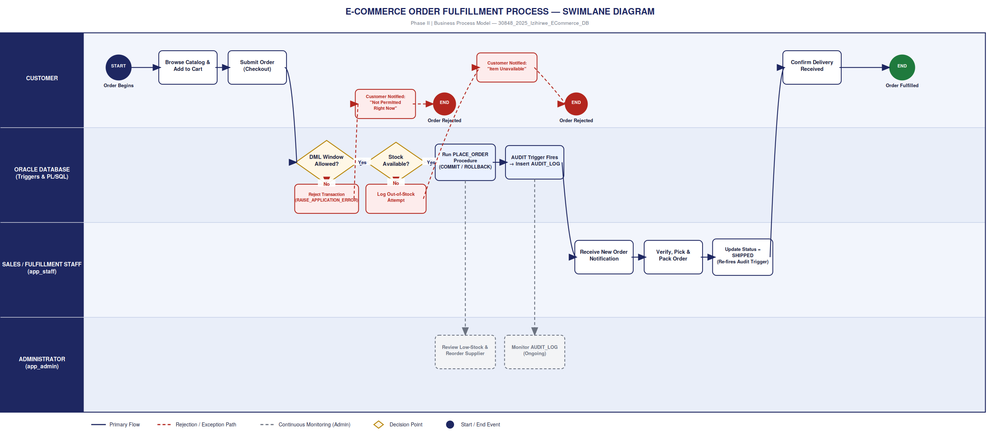

# Phase II: Business Process Modeling & Swimlane Workflow

## 📊 E-Commerce Order Fulfillment Swimlane Diagram

---

## 📑 Deliverables

* **Document Specification:** [`Phase2_BusinessProcessModel_ECommerceDB_Izihirwe_30848.docx`](Phase2_BusinessProcessModel_ECommerceDB_Izihirwe_30848.docx)
* **Diagram Graphic:** [`Phase2_SwimlaneDiagram_ECommerceDB_Izihirwe_30848.png`](Phase2_SwimlaneDiagram_ECommerceDB_Izihirwe_30848.png)

---

## 🎯 Process Overview & Key Talking Points

1. **Key Decision Points:**
   * **DML Window Allowed?** Validates operational business hours, weekdays, and holiday constraints before allowing write transactions.
   * **Stock Available?** Enforces atomic transactions via `PLACE_ORDER` (`COMMIT` or `ROLLBACK`) to eliminate overselling.

2. **Exception Handling:**
   * Blocked transactions raise `RAISE_APPLICATION_ERROR` and insert an unauthorized attempt entry directly into `AUDIT_LOG`.

3. **Continuous Oversight:**
   * Administrative monitoring runs in parallel, handling inventory threshold reviews and security audit reviews independently.