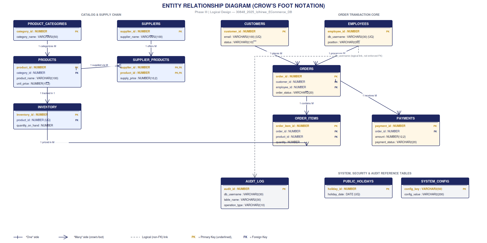

# Phase III: Logical Database Design & 3NF Normalization

## 📊 Entity Relationship Diagram (Crow's Foot Notation)

---

## 📑 Deliverables

* **Logical Design Document:** [`Phase3_LogicalDesign_ERD_ECommerceDB_Izihirwe_30848.docx`](Phase3_LogicalDesign_ERD_ECommerceDB_Izihirwe_30848.docx)
* **High-Res ERD Diagram:** [`Phase3_ERD_Diagram_ECommerceDB_Izihirwe_30848.png`](Phase3_ERD_Diagram_ECommerceDB_Izihirwe_30848.png)

---

## 🎯 Design Highlights & Defense Talking Points

1. **No `total_amount` in `ORDERS` (3NF Rule):** 
   * Avoids update anomalies. Calculated aggregated sums are derived via views in Phase V rather than stored statically.

2. **Historical Price Snapshot (`ORDER_ITEMS.unit_price`):** 
   * Captures price at the exact moment of transaction, preventing historical sales data from altering when catalog prices change.

3. **Virtual Column (`ORDER_ITEMS.subtotal`):** 
   * Uses Oracle `GENERATED ALWAYS AS (quantity * unit_price) VIRTUAL` to expose line item subtotals on read without violating 3NF.

4. **Independent `INVENTORY` Table:** 
   * Separated from `PRODUCTS` to isolate high-frequency stock update transactions from slow-changing catalog metadata.